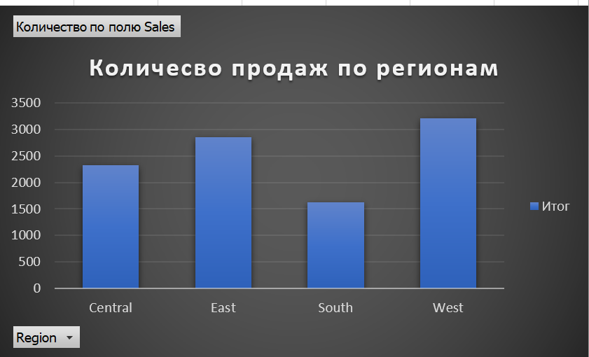
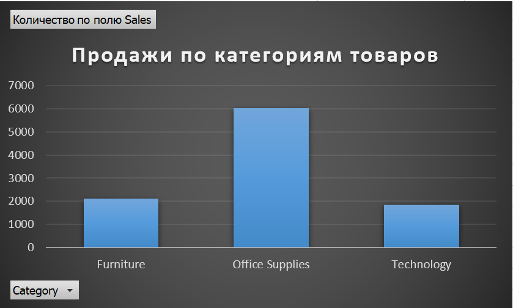
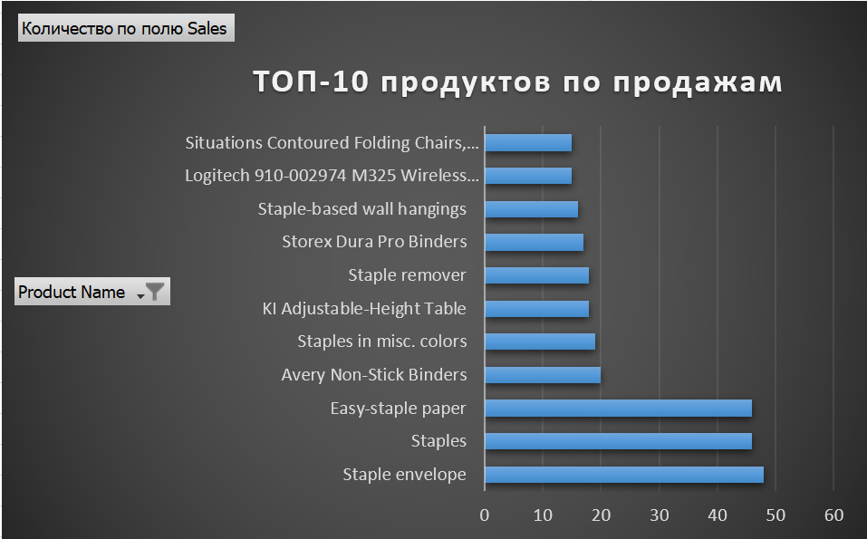
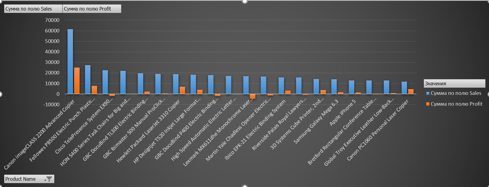

# Learning Portfolio

Добро пожаловать в мой портфель проектов по Data Analytics.  
Здесь будут размещаться мои мини-проекты, задачи и упражнения, которые я выполняю для освоения профессии аналитика данных с нуля.

## Проекты
1. Excel Mini Project — анализ продаж.
2. SQL Mini Project — работа с базой данных.
3. Python/Pandas Mini Project — очистка и анализ данных.

## 📊 Mini Project 1 — Продажи по регионам (Excel)

В этом проекте я проанализировал данные о продажах из датасета *Superstore*.  
С помощью сводной таблицы и диаграммы я нашёл, в каких регионах продажи были выше, а в каких ниже.  

**Инсайт:**  
- Наибольшие продажи: [West]  
- Наименьшие продажи: [South]  

### 🔗 Файлы проекта:
- [Excel-анализ](superstore_analysis.xlsx)  
- Скриншот графика:  

## 📊 Mini Project 2 — Продажи по категориям (Excel)

В этом проекте я проанализировал продажи по категориям товаров.  

**Инсайт:**  
- Лидер по продажам: [Technology]  
- Аутсайдер: [Office Supplies]  

### 🔗 Файлы проекта:
- [Excel-анализ](category_sales.xlsx)  
- Скриншот графика:  

## 📊 Mini Project 3 — Топ-10 продуктов по продажам

**Описание:**  
Я проанализировал продажи по каждому продукту и построил диаграмму ТОП-10 самых прибыльных товаров.  

**Инсайты:**  
- 🔹 Самый продаваемый продукт: [Canon imageCLASS 2200 Advanced Copier]  
- 🔹 Минимальный из ТОП-10: [High Speed Automatic Electric Letter Opener]  

**Технологии:**  
Excel (сводные таблицы, сортировка, диаграммы)  

**Файлы проекта:**  
- [Excel-анализ](top10_products.xlsx)  
- Скриншот диаграммы:   

## 📊 Mini Project 4 — Прибыль vs Продажи

**Описание:**  
Я сравнил показатели **Продаж (Sales)** и **Прибыли (Profit)** по каждому продукту, чтобы выявить, какие товары приносят наибольшую выгоду.  
Построил диаграмму, показывающую разницу между выручкой и прибылью для ТОП-10 продуктов.

**Инсайты:**  
- 💰 Самый продаваемый продукт: [Canon imageCLASS 2200 Advanced Copier]  
- 📉 Продукт с самой низкой прибылью: [Lexmark MX611dhe Monochrome Laser Printer]  
- 💡 Вывод: высокая выручка не всегда означает высокую прибыль, важно анализировать обе метрики одновременно.  

**Технологии:**  
Excel (сводные таблицы, фильтрация ТОП-10, сравнительные гистограммы)

**Файлы проекта:**  
- [Excel-анализ](profit_vs_sales.xlsx)  
- Скриншот диаграммы:  

