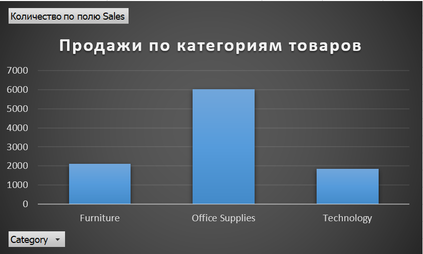
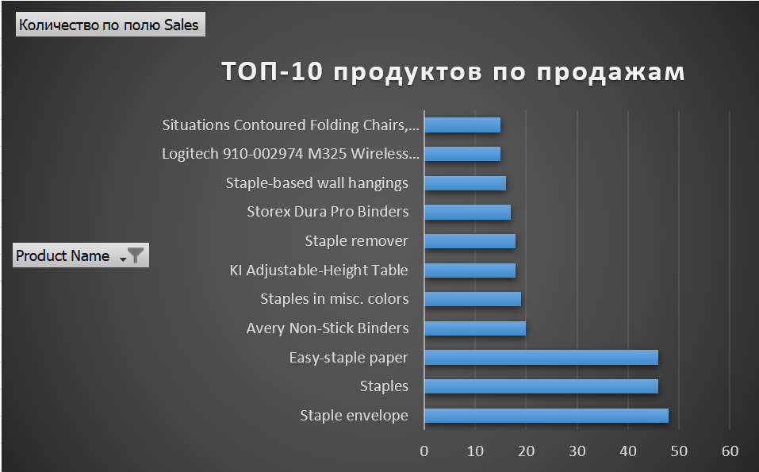

# Learning Portfolio

Добро пожаловать в мой портфель проектов по Data Analytics.  
Здесь будут размещаться мои мини-проекты, задачи и упражнения, которые я выполняю для освоения профессии аналитика данных с нуля.

## Проекты
1. Excel Mini Project — анализ продаж.
2. SQL Mini Project — работа с базой данных.
3. Python/Pandas Mini Project — очистка и анализ данных.

## 📊 Mini Project 1 — Продажи по регионам (Excel)

В этом проекте я проанализировал данные о продажах из датасета *Superstore*.  
С помощью сводной таблицы и диаграммы я нашёл, в каких регионах продажи были выше, а в каких ниже.  

**Инсайт:**  
- Наибольшие продажи: [West]  
- Наименьшие продажи: [South]  

### 🔗 Файлы проекта:
- [Excel-анализ](superstore_analysis.xlsx)  
- Скриншот графика:  

## 📊 Mini Project 2 — Продажи по категориям (Excel)

В этом проекте я проанализировал продажи по категориям товаров.  

**Инсайт:**  
- Лидер по продажам: [Office Supplies]  
- Аутсайдер: [Technology]  

### 🔗 Файлы проекта:
- [Excel-анализ](category_sales.xlsx)  
- Скриншот графика:  

## 📊 Mini Project 3 — Топ-10 продуктов по продажам

**Описание:**  
Я проанализировал продажи по каждому продукту и построил диаграмму ТОП-10 самых прибыльных товаров.  

**Инсайты:**  
- 🔹 Самый продаваемый продукт: [Staple envelope]  
- 🔹 Минимальный из ТОП-10: [Situations Contoured Folding Chairs, 4/Set]  

**Технологии:**  
Excel (сводные таблицы, сортировка, диаграммы)  

**Файлы проекта:**  
- [Excel-анализ](top10_products.xlsx)  
- Скриншот диаграммы:  

